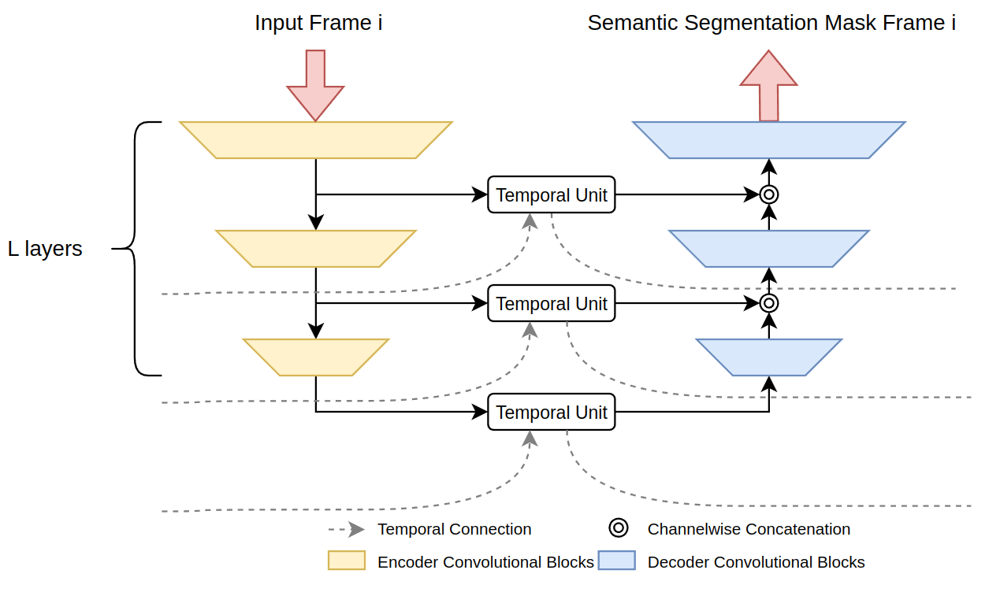

### cuda_lab_project
Authors: Siarhei Sheludzko, Patrick Schwemmer, Sebastián Gómez Ruiz

# Video Semantic Segmentation with Recurrent U-Net
The idea for this work is taken from the paper 
[Recurrent U-Net for Resource-Constrained Segmentation.](https://openaccess.thecvf.com/content_ICCV_2019/papers/Wang_Recurrent_U-Net_for_Resource-Constrained_Segmentation_ICCV_2019_paper.pdf) 
Training and evaluation is done with  [Cityscapes dataset.](https://www.cityscapes-dataset.com/)

[Task formulation](https://github.com/SergShel/cuda_lab_project/blob/main/docs/Project%2022%20WS_%20Video%20Semantic%20Segmentation.pdf) - this document describes the goals of the project and propose the approach to solve them.

## Introduction

Semantic segmentation and video semantic segmentation are dense-prediction vision tasks,
which goal is to predict a semantic class for every single pixel of an image, or respectively for every pixel for every frame that forms a video sequence. 
Its motivation comes from the wide range of applications they can be used at, such as object detection and tracking, 
which plays an important role for e.g. autonomous driving systems. We focus on video semantic segmentation, 
which brings additional challenges in comparison to its non-temporal variant. One of them being temporal consistency,
meaning that coherence of the segmentation results of adjacent frames should be present while taking into account the state of an object, 
such as its motion and appearance. Other difficulties arise directly from objects' movement, such as occlusion or motion blur. 

We use an [UNet based architecture neural network](https://link.springer.com/chapter/10.1007/978-3-319-24574-4_28) to tackle this task, which we adapt with convolutional 
temporal modules in order to take advantage of the temporal nature of the data and overcome the previously mentioned challenges.
Multiple variations of the models are implemented, as well as trained and evaluated on the [Cityscapes dataset](https://www.cityscapes-dataset.com/), 
a benchmark large-dataset that provides semantic and pixel-wide annotations for urban street scenery. 
The different model configurations and results are presented and analyzed in detail in further sections, as well as the process itself. 
In which we contrast a baseline result obtained by using the model to process the data in a frame by frame manner, 
with the results obtained by using the model to process the data with the temporal modules in a sequenced (multiple-frames) manner. 
Analysis is given through the whole method itself and results, for the model design and its evaluation, 
we also discuss about limitations during the development of the project itself, difficulties and challenges of the process and task as a whole, 
as well as possible aspects of improvement.

## Architecture

In our approach we extended a UNet architecture \cite{unet} by incorporating convolutional recurrent neural network units (cRNN) and convolutional gated recurrent units (cGRU) as temporal units. Our proposed architecture can be decomposed into multiple encoding and decoding layers, each consisting of multiple typical convolutional block that include 2D-Convolutions, batch-normalization, an activation function, each encoder block including down-sampling done with a convolution and each decoder block including up-sampling done with a transposed convolution. At the end of each encoder block we include one of the convolutional temporal cells, either cRNN or cGRU to capture the temporal dependencies in the image data, while at the decoder blocks we concatenate with the hidden state given by either cRNN or cGRU. 

The following figure presents the general model architecture

  

Please refer to our [report](https://github.com/SergShel/cuda_lab_project/blob/main/docs/CudaLab_Report.pdf) for further information on the architecture, design of the training and detailed results.

## Results

### Baselines:

#### Vanilla Original size:

  

#### VanillaSmallDeep:

  

#### BaselineVanillaSmallShallow:

  

According to the validation metrics (mIoU and mAcc) "Vanilla Original size"-model should perform better then other 2. But visually we can see that VanillaSmallDeep is the leader. All the predictions (even by VanillaSmallDeep) have some chaotic flickering by changing frames.

You can find more visualizations for these 3 (baseline) models here: [resources/gifs/Baselines](resources/gifs/Baselines)

### Temporal models

#### ResUNet with Conv2dGRUCell SmallDeep:

  

#### ResUNet with Conv2dGRUCell SmallShallow:

  

#### ConvUNext with Conv2dGRUCell SmallDeep:

  

#### VanillaUNet with Conv2dGRUCell SmallShallow:

  

#### VanillaUNet  with Conv2dRNNCell SmallShallow:

  

According to the validation metrics (mAcc and mIoU) the leader in the group of temporal models has to be "ResUNet with Conv2dGRUCell SmallDeep". That corresponds to the observed results. 

You can find more visualizations for these 3 (temporal) models here: [resources/gifs/Temporal](resources/gifs/Temporal)

In general, we can observe the following pattern:  
* first image in the sequence has some level of false predicted regions
* every following frame has better prediction

These results prove the advantage of usage of recurrent modules as part of U-Net

